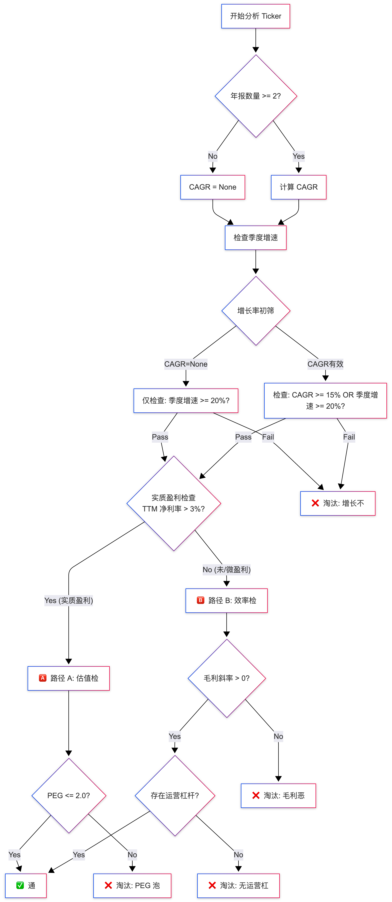

# Mahaney Growth Protocol (MGP) V3.0 - Python Implementation

这是一个基于马克·马哈尼（Mark Mahaney）成长股投资策略 **MGP V3.0** 的自动化分析系统。该系统通过严密的“筛选-分析-决策”闭环，结合定量财务数据与定性 AI 分析，寻找被错误定价的高质量成长股 (DHQA)。

## 核心功能

系统通过四个阶段的流水线自动处理股票分析：

1.  **Phase 1: 铁律筛选 (The Iron Gate)**
    *   **纯定量过滤**：基于 FMP API 的财务数据。
    *   **核心指标**：5年营收 CAGR (>20%)、季度增速、减速预警、PEG (<2.0) 或 毛利斜率/运营杠杆（针对未盈利股及微利股）。
    *   **改进机制**：
        *   **新股保护**：上市时间短数据不足时，仅依赖季度增速判定，避免被 CAGR 逻辑误杀。
        *   **微利豁免**：净利率 < 3% 的微利企业，强制走未盈利逻辑（看运营效率），避免 PEG 虚高导致误杀。
    *   **筛选流程**：

    

    ```mermaid
    graph TD
        Start[开始分析 Ticker] --> CheckData{年报数量 >= 2?}
        
        CheckData -- No --> SetCAGRNone[CAGR = None]
        CheckData -- Yes --> CalcCAGR[计算 CAGR]
        
        SetCAGRNone --> CheckQ[检查季度增速]
        CalcCAGR --> CheckQ
        
        CheckQ --> GrowthGate{增长率初筛}
        
        GrowthGate -- "CAGR=None" --> Gate1[仅检查: 季度增速 >= 20%?]
        GrowthGate -- "CAGR有效" --> Gate2[检查: CAGR >= 15% OR 季度增速 >= 20%?]
        
        Gate1 -- Pass --> ProfitCheck
        Gate2 -- Pass --> ProfitCheck
        Gate1 -- Fail --> Reject[❌ 淘汰: 增长不足]
        Gate2 -- Fail --> Reject
        
        ProfitCheck{实质盈利检查<br>TTM 净利率 > 3%?}
        
        ProfitCheck -- Yes (实质盈利) --> PathA[🅰️ 路径 A: 估值检查]
        ProfitCheck -- No (未/微盈利) --> PathB[🅱️ 路径 B: 效率检查]
        
        PathA --> PEGCheck{PEG <= 2.0?}
        PEGCheck -- Yes --> Pass[✅ 通过]
        PEGCheck -- No --> RejectPEG[❌ 淘汰: PEG 泡沫]
        
        PathB --> MarginCheck{毛利斜率 > 0?}
        MarginCheck -- Yes --> LevCheck{存在运营杠杆?}
        MarginCheck -- No --> RejectMargin[❌ 淘汰: 毛利恶化]
        
        LevCheck -- Yes --> Pass
        LevCheck -- No --> RejectLev[❌ 淘汰: 无运营杠杆]
    ```

    *   **作用**：剔除 90% 基本面不合格的标的。

2.  **Phase 2: DNA 识别 (The Identifier)**
    *   **商业模式分类**：利用 LLM 将公司分类为 SaaS、消费云、双边市场、广告等。
    *   **KPI 锁定**：自动确定该模式下最重要的特异性指标（如 NDR, GMV, RPO）。

3.  **Phase 3: 靶向情报 (Saturated Intelligence)**
    *   **AI 搜索验证**：使用 Tavily 搜索引擎查找特定 KPI 的最新数值（如财报会议披露的数据）。
    *   **软实力画像**：分析管理层诚信度（指引兑现情况）、护城河变化及内部人交易。
    *   **价格异动分析**：判断当前下跌是“真打折”（宏观错杀）还是“假打折”（逻辑破损）。

4.  **Phase 4: 最终审判 (The Tribunal)**
    *   **AI 决策**：综合硬数据与软情报，模拟 CIO 角色进行决策。
    *   **输出**：生成 Strong Buy / Buy / Hold / Sell 评级及置信度。

## 环境要求

你需要以下 API Key 才能运行此系统：

*   **Financial Modeling Prep (FMP)**: 用于核心财务数据。
*   **OpenAI API**: 用于逻辑分析和非结构化数据处理。
*   **Tavily API**: 用于实时网络搜索和情报搜集。

## 安装指南

1.  **克隆项目**
    ```bash
    git clone <repository_url>
    cd Growth
    ```

2.  **安装依赖**
    ```bash
    pip install -r requirements.txt
    ```

3.  **配置环境**
    创建 `.env` 文件并填入你的 API Key：
    ```bash
    FMP_API_KEY=your_fmp_key
    OPENAI_API_KEY=your_openai_key
    TAVILY_API_KEY=your_tavily_key
    ```

## 使用方法

运行 `main.py` 并指定股票代码：

```bash
# 分析单只股票
python main.py --tickers SNOW

# 分析多只股票
python main.py --tickers DDOG,CRWD,NET

# 强制深度分析（忽略 Iron Gate 失败）
python main.py --tickers UBER --force
```

## 输出结果

系统会生成以下两种输出：

1.  **Markdown 研报 (`REPORT_{TICKER}_{DATE}.md`)**：
    *   包含详细的分析逻辑、KPI 数据、软实力评估和最终决策理由。
2.  **JSON 数据 (`results.json`)**：
    *   包含所有分析过程中的结构化数据，便于后续程序处理或回测。

## 项目结构

```
/
├── config.py             # 配置加载
├── main.py               # CLI 入口
├── core/                 # 数据模型定义
├── tools/                # API 客户端 (FMP, OpenAI, Tavily)
└── phases/               # 策略核心逻辑
    ├── iron_gate.py      # 第一阶段：定量筛选
    ├── identifier.py     # 第二阶段：模式识别
    ├── intelligence.py   # 第三阶段：情报搜集
    └── tribunal.py       # 第四阶段：决策逻辑
```

## 免责声明

本工具仅用于辅助研究和学习 MGP 策略，**不构成任何投资建议**。投资有风险，入市需谨慎。

