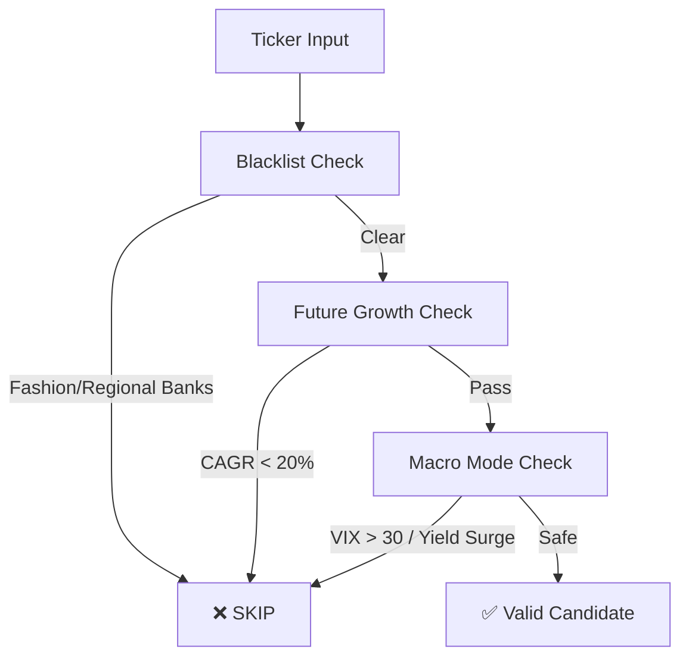
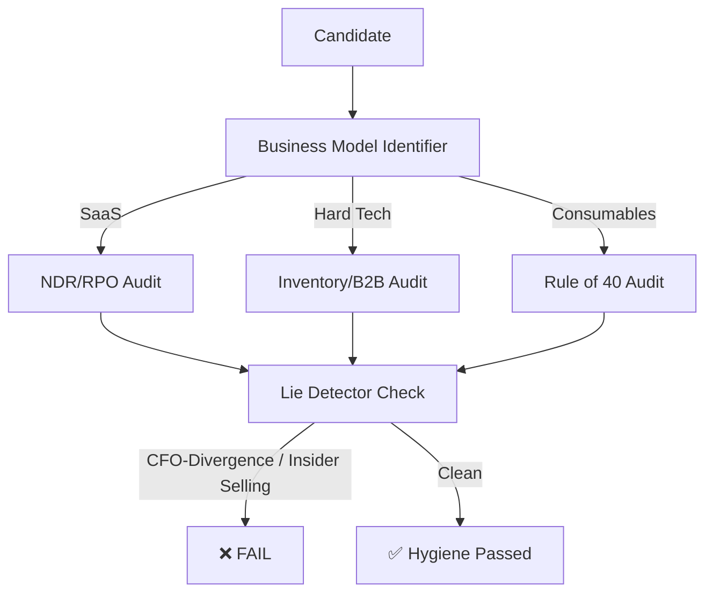
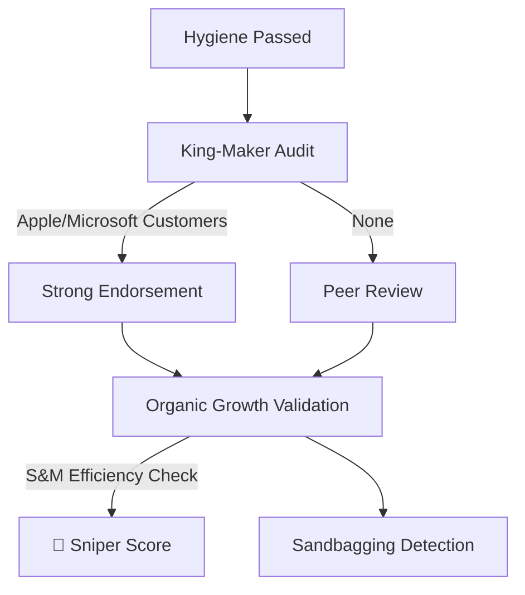
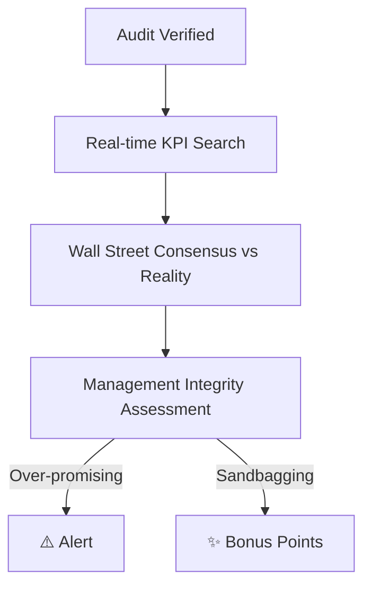
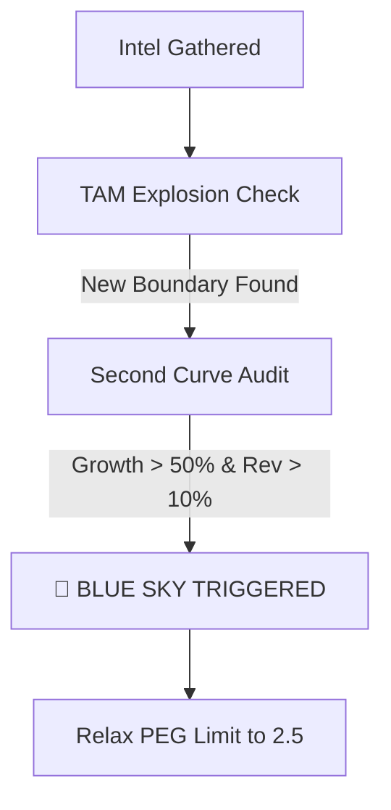
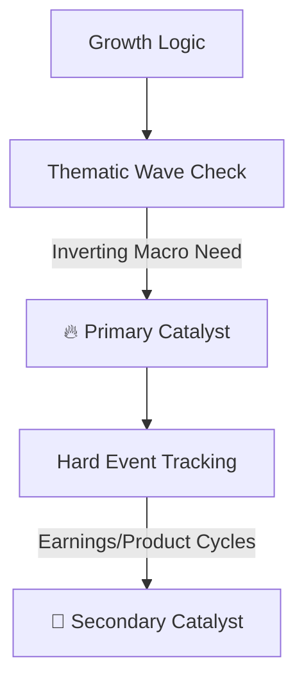
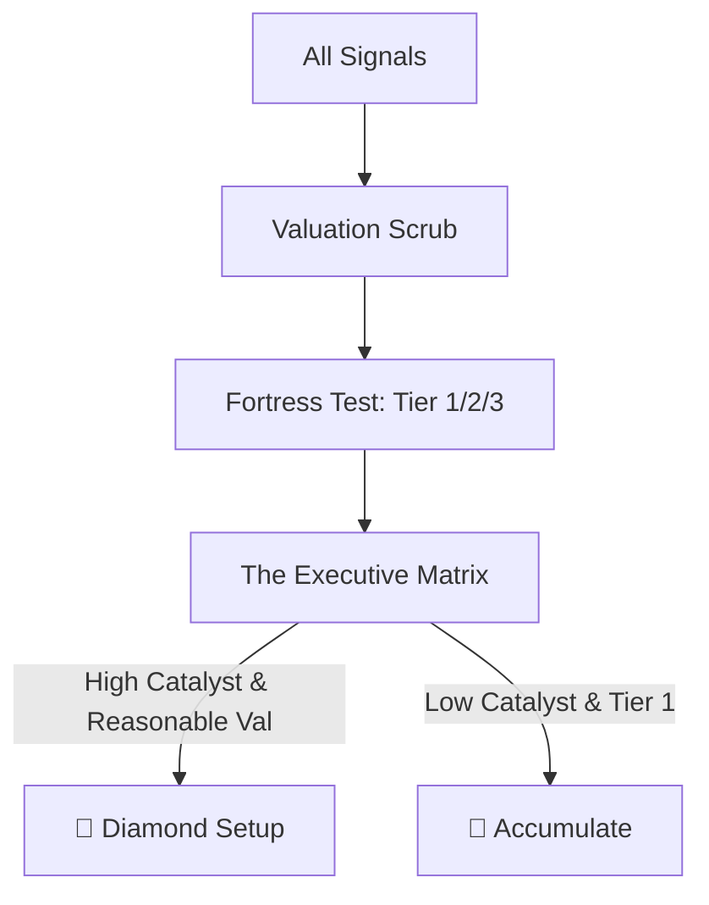
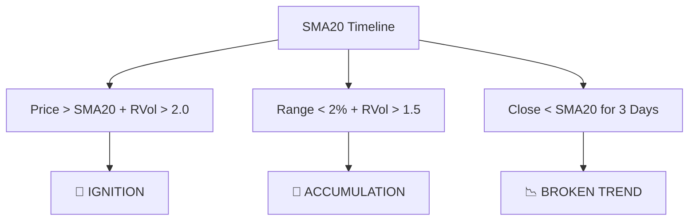
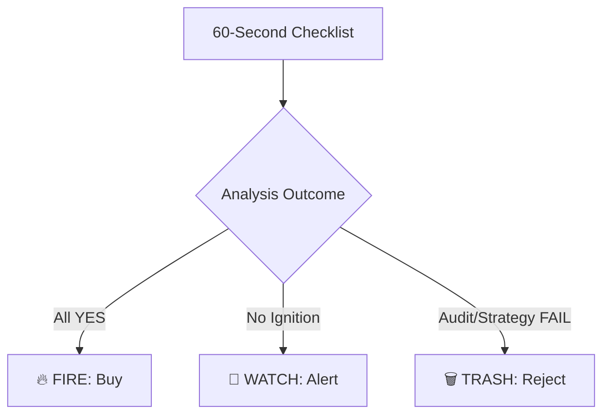

# 🐺 Mahaney Growth Protocol (MGP) V3.5

[English Version](#-english) | [中文版本](#-chinese)

---

<h1 id="-english">🇺🇸 English</h1>

### —— The "Blue Sky" Edition
**"Full-Dimensional Strategic" Combat System for Mid-to-Large Cap Growth Stocks**

> **Status**: LIVE (Strategic Integration)
> **Core Evolution**: Evolved from "finding growth" to "finding **undervalued explosive power**."
> **Core Philosophy**:
> *   **Quality**: Moat determines how long you survive.
> *   **Blue Sky**: The second curve determines how high you fly.
> *   **Waves**: Industry-wide demand determines how fast you take off.

---

## 🚫 Phase 0: Gatekeeper
**Goal**: Filter out 90% of the noise using the "Elimination Method."


```mermaid
flowchart TD
    In["Ticker Input"] --> B["Blacklist Check"]
    B -- "Fashion/Regional Banks" --> Fail["❌ SKIP"]
    B -- "Clear" --> G["Future Growth Check"]
    G -- "CAGR < 20%" --> Fail
    G -- "Pass" --> M["Macro Mode Check"]
    M -- "VIX > 30 / Yield Surge" --> Fail
    M -- "Safe" --> Out["✅ Valid Candidate"]
```

1.  **🚫 The Kill Zone**: Fashion, regional banks, asset-heavy/low-margin businesses.
2.  **⚡️ The Iron Rule**: Expected revenue CAGR > 20% for the next 3 years.
3.  **📉 Macro Pressure Valve**: Triggers circuit breaker if VIX > 30 or Treasury yields surge.

---

## 🔍 Phase 1: Deep Audit
**Goal**: Tiered "physical exam" of business models to identify true revenue quality.


```mermaid
flowchart TD
    In["Candidate"] --> Seg["Business Model Identifier"]
    Seg -- "SaaS" --> SaaS["NDR/RPO Audit"]
    Seg -- "Hard Tech" --> Hard["Inventory/B2B Audit"]
    Seg -- "Consumables" --> Cons["Rule of 40 Audit"]
    SaaS & Hard & Cons --> Lie["Lie Detector Check"]
    Lie -- "CFO-Divergence / Insider Selling" --> Fail["❌ FAIL"]
    Lie -- "Clean" --> Out["✅ Hygiene Passed"]
```

*   **SaaS**: NDR > 110%, RPO growth > Revenue growth.
*   **Hard Tech**: Book-to-Bill > 1.0, strictly prevent "Inventory Death Cross."
*   **Platform/Consumables**: Rule of 40, LTV/CAC > 3.
*   **Lie Detector**: Audit CFO/Net Income divergence and assess insider selling risks.

---

## 🕵️ Phase 2: Shadow Audit
**Goal**: Verify business status through external evidence.


```mermaid
flowchart TD
    In["Hygiene Passed"] --> King["King-Maker Audit"]
    King -- "Apple/Microsoft Customers" --> Trust["Strong Endorsement"]
    King -- "None" --> Peer["Peer Review"]
    Trust & Peer --> Org["Organic Growth Validation"]
    Org -- "S&M Efficiency Check" --> Sniper["🎯 Sniper Score"]
    Org --> Sand["Sandbagging Detection"]
```

*   **King Makers**: Are giants like Apple, Microsoft, or Nvidia among the customers?
*   **Organic Growth**: S&M expenses decreasing while revenue per customer increases.
*   **Sandbagging Detection**: Does management have a habit of providing conservative guidance but consistently beating expectations?

---

## 🧠 Phase 3: Intelligence
**Goal**: Qualitative analysis of management integrity, moat dynamics, and KPI verification.


```mermaid
flowchart TD
    In["Audit Verified"] --> Search["Real-time KPI Search"]
    Search --> Compare["Wall Street Consensus vs Reality"]
    Compare --> Integrity["Management Integrity Assessment"]
    Integrity -- "Over-promising" --> Alert["⚠️ Alert"]
    Integrity -- "Sandbagging" --> Bonus["✨ Bonus Points"]
```

*   **KPI Search Verification**: Real-time search and comparison of industry-specific metrics (e.g., ARR, DAU).
*   **Moat Assessment**: Is the competitive advantage expanding or eroding?

---

## 🔭 Phase 4: Blue Sky Analysis
**Goal**: Identify "premium engines" driving high valuations.


```mermaid
flowchart TD
    In["Intel Gathered"] --> TAM["TAM Explosion Check"]
    TAM -- "New Boundary Found" --> RND["Second Curve Audit"]
    RND -- "Growth > 50% & Rev > 10%" --> Trigger["🚀 BLUE SKY TRIGGERED"]
    Trigger --> Rerate["Relax PEG Limit to 2.5"]
```

*   **TAM Explosion**: Logic of doubling Total Addressable Market due to technological breakthroughs.
*   **Second Growth Curve**: New business growth > 50% and accounting for > 10% of revenue.
*   **Valuation Exemption**: For companies triggering "Blue Sky" logic, the PEG limit can be relaxed to 2.5.

---

## 🌊 Phase 5: Catalysts & Waves
**Core Principle: Macro Need > Micro Events**


```mermaid
flowchart TD
    In["Growth Logic"] --> Wave["Thematic Wave Check"]
    Wave -- "Inverting Macro Need" --> Primary["🔥 Primary Catalyst"]
    Primary --> Hard["Hard Event Tracking"]
    Hard -- "Earnings/Product Cycles" --> Secondary["📅 Secondary Catalyst"]
```

*   **Primary Catalysts (Thematic Waves)**: Irreversible industry momentum (e.g., labor shortages driving AI demand).
*   **Secondary Catalysts (Hard Events)**: Specific validation nodes like earnings reports, product launches, or investor days.

---

## ♟️ Phase 6: Strategic Pricing
**Goal**: Convert all qualitative intelligence into quantitative operational instructions.


```mermaid
flowchart TD
    In["All Signals"] --> VScrub["Valuation Scrub"]
    VScrub --> Fortress["Fortress Test: Tier 1/2/3"]
    Fortress --> Matrix["The Executive Matrix"]
    Matrix -- "High Catalyst & Reasonable Val" --> Diamond["💎 Diamond Setup"]
    Matrix -- "Low Catalyst & Tier 1" --> Acc["🏰 Accumulate"]
```

1.  **Valuation Scrub**: Adjust valuation multiples based on management integrity (Sandbagger/Over-Promiser).
2.  **Fortress Test**: Certification for core holdings, categorized into Tier 1/2/3.
3.  **Executive Matrix**: Combines catalyst strength and valuation status to output:
    *   💎 **Diamond Setup** (The perfect entry point)
    *   🚀 **Momentum Ride** (Trend-driven chasing)
    *   🏰 **Fortress Accumulation** (Building base positions on the left side)

---

## 🚀 Phase 7: Physics VPA
**Goal**: Institutional behavior analysis based on the SMA20 lifeline.


```mermaid
flowchart TD
    Price["SMA20 Timeline"] --> Ignite["Price > SMA20 + RVol > 2.0"]
    Ignite --> FIRE["🚀 IGNITION"]
    Price --> Accum["Range < 2% + RVol > 1.5"]
    Accum --> ACC["🔋 ACCUMULATION"]
    Price --> Broken["Close < SMA20 for 3 Days"]
    Broken --> EJECT["📉 BROKEN TREND"]
```

*   **Ignition**: High-volume breakout of SMA20, RVol > 2.0, strong close.
*   **Accumulation**: Tight range (< 2%) + volume (RVol > 1.5).
*   **Broken Trend**: Closing below SMA20 for 3 consecutive days.

---

## 🛡️ Phase 8: The Tribunal
**Goal**: Final 60-second heptathlon checklist before placing an order.


```mermaid
flowchart TD
    Chk["60-Second Checklist"] --> Out{Analysis Outcome}
    Out -- "All YES" --> F["🔥 FIRE: Buy"]
    Out -- "No Ignition" --> W["👀 WATCH: Alert"]
    Out -- "Audit/Strategy FAIL" --> T["🗑️ TRASH: Reject"]
```

---

## 📑 Citation System
The system implements **academic-grade citation tagging** in reports:
- **In-text Citations**: Real-time annotation of data sources using `[1]`, `[2]`, etc.
- **Dynamic Indexing**: Automatically tracks search sources and generates a `References & Sources` list at the footer.
- **Anti-Hallucination**: ID indexing ensures the LLM retrieves real search results and links.

---

## 🛠️ Installation & Usage

```bash
# 1. Install dependencies
pip install -r requirements.txt

# 2. Configure .env
FMP_API_KEY=xxx
OPENAI_API_KEY=xxx
TAVILY_API_KEY=xxx

# 3. Run Analysis
python main.py --tickers AXON,PLTR --force
```

---

## 📝 Project Structure
```
/
├── main.py               # Core pipeline and report engine
├── core/
│   └── data_models.py    # V3.5 Pydantic models
├── phases/               # 8 Analysis phase modules
│   ├── gatekeeper.py
│   ├── deep_audit.py
│   ├── shadow_audit.py
│   ├── intelligence.py
│   ├── catalysts.py
│   ├── strategy.py
│   ├── physics.py
│   └── tribunal.py
└── tools/                # FMP, Yahoo, Tavily, LLM adapters
```

---

*Disclaimer: This system is for research purposes only and does not constitute investment advice.*

<br><br><br>

---

<h1 id="-chinese">🇨🇳 中文</h1>

### —— 蓝天视界版 (The "Blue Sky" Edition)
**中大盘成长股“全维度战略”作战系统**

> **版本状态**：LIVE (Strategic Integration)
> **核心进化**：从“寻找增长”进化为“寻找**被低估的爆发力**”。
> **核心哲学**：
> *   **质地 (Quality)**：护城河决定了你能活多久。
> *   **蓝天 (Blue Sky)**：第二曲线决定了你能飞多高。
> *   **势能 (Waves)**：全行业刚需决定了你起飞的速度。

---

## 🚫 Phase 0: 门槛熔断 (Gatekeeper)
**目标**：用“排除法”过滤掉 90% 的杂音。


```mermaid
flowchart TD
    In["Ticker Input"] --> B["Blacklist Check"]
    B -- "Fashion/Regional Banks" --> Fail["❌ SKIP"]
    B -- "Clear" --> G["Future Growth Check"]
    G -- "CAGR < 20%" --> Fail
    G -- "Pass" --> M["Macro Mode Check"]
    M -- "VIX > 30 / Yield Surge" --> Fail
    M -- "Safe" --> Out["✅ Valid Candidate"]
```

1.  **🚫 绝对黑名单 (The Kill Zone)**：服饰、区域银行、重资产/低毛利。
2.  **⚡️ 20% 铁律 (The Iron Rule)**：未来 3 年预期营收 CAGR > 20%。
3.  **📉 宏观压力阀**：VIX > 30 或美债收益率飙升时触发熔断。

---

## 🔍 Phase 1: 深度审计 (Deep Audit)
**目标**：商业模式分层体检，识别真实的营收质地。


```mermaid
flowchart TD
    In["Candidate"] --> Seg["Business Model Identifier"]
    Seg -- "SaaS" --> SaaS["NDR/RPO Audit"]
    Seg -- "Hard Tech" --> Hard["Inventory/B2B Audit"]
    Seg -- "Consumables" --> Cons["Rule of 40 Audit"]
    SaaS & Hard & Cons --> Lie["Lie Detector Check"]
    Lie -- "CFO-Divergence / Insider Selling" --> Fail["❌ FAIL"]
    Lie -- "Clean" --> Out["✅ Hygiene Passed"]
```

*   **SaaS**: NDR > 110%, RPO 增速 > 营收增速。
*   **硬科技**: Book-to-Bill > 1.0, 严防“库存死亡交叉”。
*   **平台消费**: Rule of 40, LTV/CAC > 3。
*   **Lie Detector**: CFO 与净利润背离审计，内幕减持风险评估。

---

## 🕵️ Phase 2: 影子验证 (Shadow Audit)
**目标**：通过外部证据验证生意地位。


```mermaid
flowchart TD
    In["Hygiene Passed"] --> King["King-Maker Audit"]
    King -- "Apple/Microsoft Customers" --> Trust["Strong Endorsement"]
    King -- "None" --> Peer["Peer Review"]
    Trust & Peer --> Org["Organic Growth Validation"]
    Org -- "S&M Efficiency Check" --> Sniper["🎯 Sniper Score"]
    Org --> Sand["Sandbagging Detection"]
```

*   **造王者 (King Makers)**：客户中是否有 Apple, Microsoft, Nvidia 等巨头？
*   **有机增长 (Organic Growth)**：S&M 占比下降而单客收入增加。
*   **沙袋检测 (Sandbagging)**：管理层是否有指引保守但实际超预期的习惯。

---

## 🧠 Phase 3: 软性情报 (Intelligence)
**目标**：定性分析管理层诚信、护城河动向及 KPI 验证。


```mermaid
flowchart TD
    In["Audit Verified"] --> Search["Real-time KPI Search"]
    Search --> Compare["Wall Street Consensus vs Reality"]
    Compare --> Integrity["Management Integrity Assessment"]
    Integrity -- "Over-promising" --> Alert["⚠️ Alert"]
    Integrity -- "Sandbagging" --> Bonus["✨ Bonus Points"]
```

*   **KPI 搜索验证**：针对行业特异指标（如 ARR, DAU）进行实时搜索对照。
*   **护城河评估**：竞争优势是在扩大还是被侵蚀。

---

## 🔭 Phase 4: 蓝天展望 (Blue Sky Analysis)
**目标**：寻找高估值的“溢价引擎”。


```mermaid
flowchart TD
    In["Intel Gathered"] --> TAM["TAM Explosion Check"]
    TAM -- "New Boundary Found" --> RND["Second Curve Audit"]
    RND -- "Growth > 50% & Rev > 10%" --> Trigger["🚀 BLUE SKY TRIGGERED"]
    Trigger --> Rerate["Relax PEG Limit to 2.5"]
```

*   **TAM 爆炸**：由于技术突破导致的潜在市场规模翻倍逻辑。
*   **第二增长曲线**：新业务增速 > 50%且占比超过 10%。
*   **估值豁免**：触发蓝天逻辑的公司，PEG 限制可放宽至 2.5。

---

## 🌊 Phase 5: 势能与催化 (Catalysts & Waves)
**核心修正：宏观需求 (Macro Need) > 微观事件 (Micro Events)**


```mermaid
flowchart TD
    In["Growth Logic"] --> Wave["Thematic Wave Check"]
    Wave -- "Inverting Macro Need" --> Primary["🔥 Primary Catalyst"]
    Primary --> Hard["Hard Event Tracking"]
    Hard -- "Earnings/Product Cycles" --> Secondary["📅 Secondary Catalyst"]
```

*   **一级催化 (Thematic Waves)**：全行业不可逆势能（如劳动力短缺驱动 AI 刚需）。
*   **二级催化 (Hard Events)**：财报、产品发布、投资者日等具体验证节点。

---

## ♟️ Phase 6: 战略定价 (Strategic Pricing)
**目标**：将所有定性情报转化为定量操作指令。


```mermaid
flowchart TD
    In["All Signals"] --> VScrub["Valuation Scrub"]
    VScrub --> Fortress["Fortress Test: Tier 1/2/3"]
    Fortress --> Matrix["The Executive Matrix"]
    Matrix -- "High Catalyst & Reasonable Val" --> Diamond["💎 Diamond Setup"]
    Matrix -- "Low Catalyst & Tier 1" --> Acc["🏰 Accumulate"]
```

1.  **Valuation Scrub**：根据管理层诚信度（Sandbagger/Over-Promiser）修正估值倍数。
2.  **Fortress Test**：底仓资格认证，划分为 Tier 1/2/3。
3.  **Executive Matrix**：结合催化剂强度与估值状态，输出：
    *   💎 **Diamond Setup** (完美的击球点)
    *   🚀 **Momentum Ride** (趋势驱动的追涨)
    *   🏰 **Fortress Accumulation** (左侧底仓建仓)

---

## 🚀 Phase 7: 量价物理学 (Physics VPA)
**目标**：基于 SMA20 生命线的机构行为分析。


```mermaid
flowchart TD
    Price["SMA20 Timeline"] --> Ignite["Price > SMA20 + RVol > 2.0"]
    Ignite --> FIRE["🚀 IGNITION"]
    Price --> Accum["Range < 2% + RVol > 1.5"]
    Accum --> ACC["🔋 ACCUMULATION"]
    Price --> Broken["Close < SMA20 for 3 Days"]
    Broken --> EJECT["📉 BROKEN TREND"]
```

*   **Ignition (点火)**：放量突破 SMA20，RVol > 2.0，强力收盘。
*   **Accumulation (吸筹)**：紧凑振幅 (< 2%) + 放量 (RVol > 1.5)。
*   **Broken Trend (破位)**：连续 3 日收盘于 SMA20 之下。

---

## 🛡️ Phase 8: 最终审判 (The Tribunal)
**目标**：下单前的最后 60 秒 6 项全能核对清单。


```mermaid
flowchart TD
    Chk["60-Second Checklist"] --> Out{Analysis Outcome}
    Out -- "All YES" --> F["🔥 FIRE: Buy"]
    Out -- "No Ignition" --> W["👀 WATCH: Alert"]
    Out -- "Audit/Strategy FAIL" --> T["🗑️ TRASH: Reject"]
```

---

## 📑 引用系统 (Citation System)
本系统在报告中实现了**学术级引用标识**：
- **全文引用**：分析内容中通过 `[1]`, `[2]` 实时标注数据来源。
- **动态索引**：自动追踪搜索源，在页脚生成 `References & Sources` 列表。
- **防幻觉机制**：ID 索引确保 LLM 引用的是真实搜索结果链接。

---

## 🛠️ 安装与使用

```bash
# 1. 安装依赖
pip install -r requirements.txt

# 2. 配置 .env
FMP_API_KEY=xxx
OPENAI_API_KEY=xxx
TAVILY_API_KEY=xxx

# 3. 运行分析
python main.py --tickers AXON,PLTR --force
```

---

## 📝 项目结构
```
/
├── main.py               # 核心流水线与报告引擎
├── core/
│   └── data_models.py    # V3.5 Pydantic 模型
├── phases/               # 8 大分析阶段模块
│   ├── gatekeeper.py
│   ├── deep_audit.py
│   ├── shadow_audit.py
│   ├── intelligence.py
│   ├── catalysts.py
│   ├── strategy.py
│   ├── physics.py
│   └── tribunal.py
└── tools/                # FMP, Yahoo, Tavily, LLM 配器
```

---

*免责声明：本系统仅供研究使用，不构成任何投资建议。*