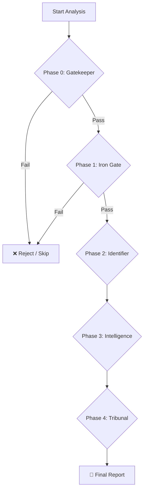
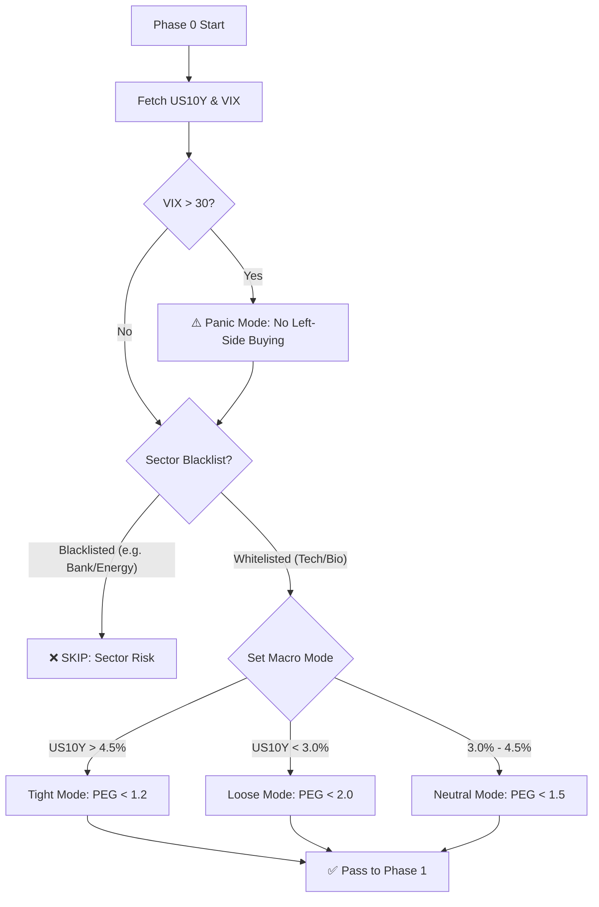
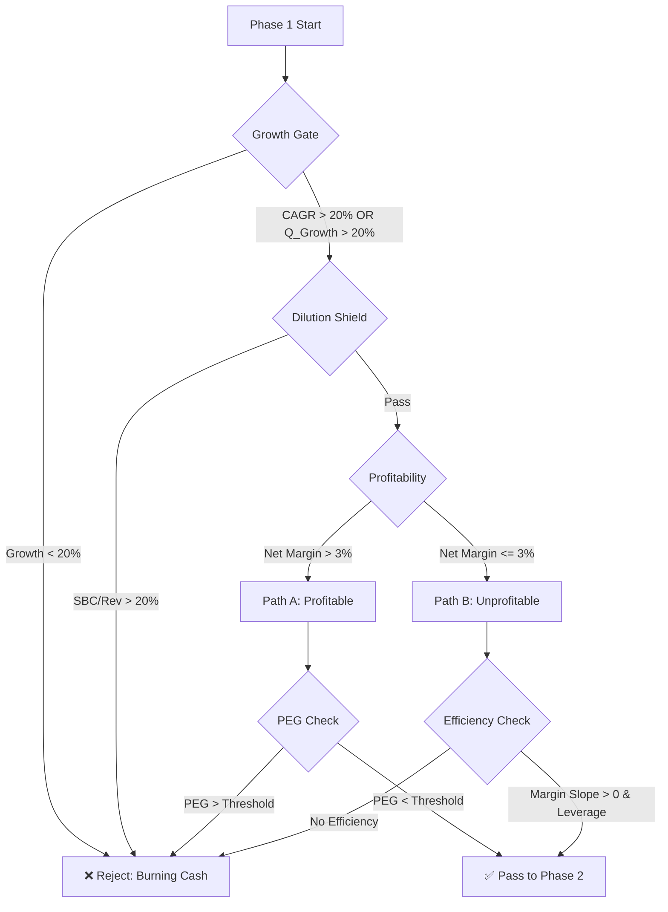
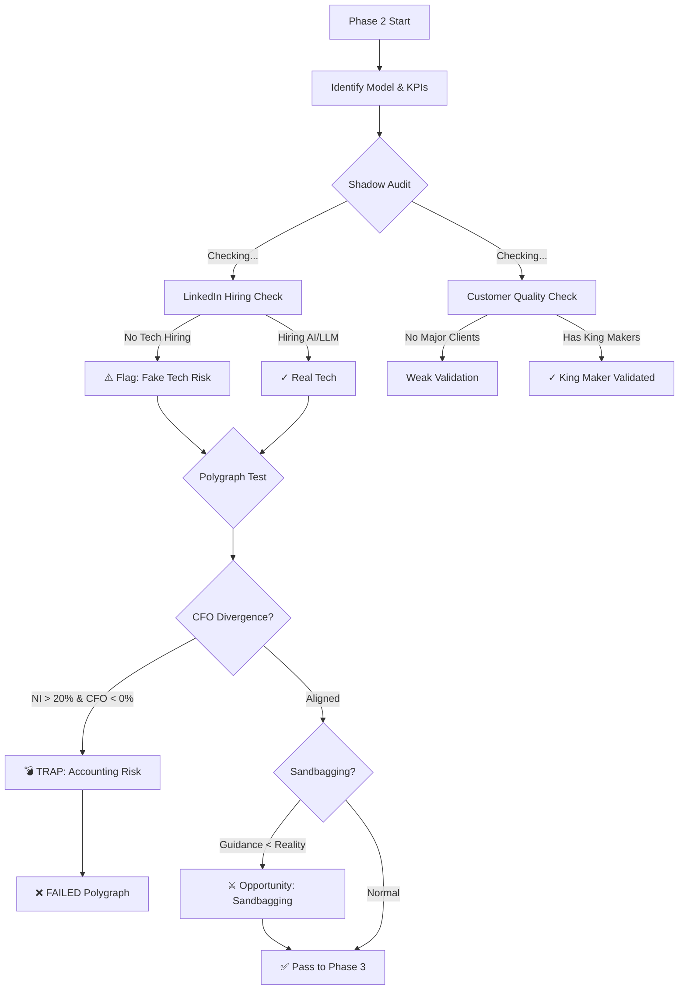
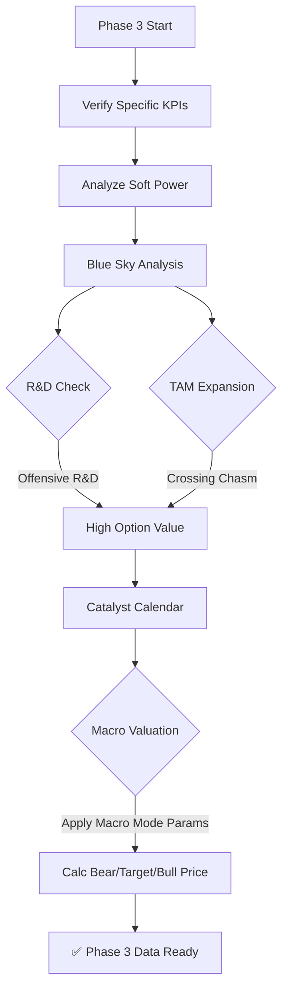
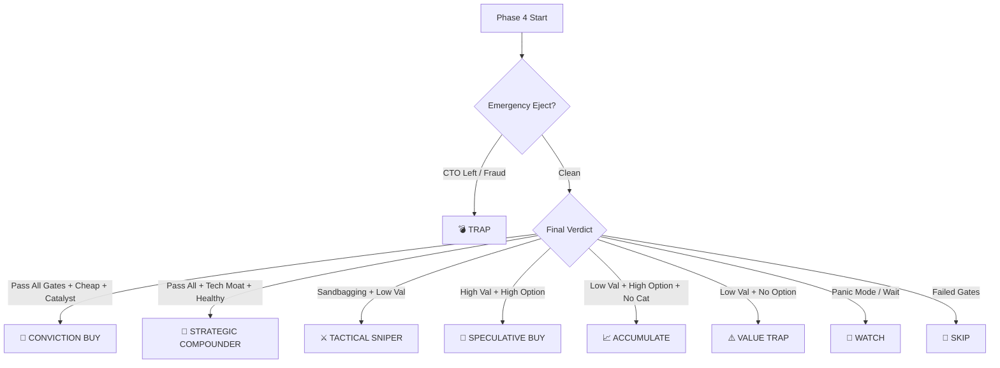

# Mahaney Growth Protocol (MGP) V3.4 - Python Implementation

**—— 针对 $10B - $50B 中大盘成长股的“反脆弱全景套利”系统**

**版本代号**：V3.4 (The Anti-Fragile Patch)
**适用范围**：市值 $10 Billion ~ $50 Billion 美金（避开极度操控的 Mega-cap 和极度脆弱的 Micro-cap）。

这是一个基于马克·马哈尼（Mark Mahaney）成长股投资策略 **MGP V3.4** 的自动化分析系统。该版本引入了“影子数据验证”与“宏观压力阀”，旨在将策略从单纯的“进攻矛”升级为“带盾牌的长矛兵”。

---

## 核心哲学 (Core Philosophy)

本策略依然根植于寻找 **DHQA (Dislocated High-Quality Assets)**，但 V3.4 版本承认个人投资者的**信息劣势**与**宏观盲区**：

1.  **宏观关 (Macro Gate)**：用 10Y 美债收益率作为估值锚点，用 VIX 作为熔断开关。
2.  **影子审计 (Shadow Audit)**：用“非财务数据”（如 LinkedIn 招聘、客户含金量）去验证护城河的真实性。
3.  **测谎仪 (Polygraph)**：用现金流背离和沙袋指数去破解管理层的画饼和低指引。

---

## 核心功能流水线 (Pipeline)

系统通过五个阶段的流水线自动处理股票分析。

### 0. 全局总览 (Global Overview)


```mermaid
graph TD
    Start[Start Analysis] --> Gatekeeper{Phase 0: Gatekeeper}
    
    Gatekeeper -- "Pass" --> IronGate{Phase 1: Iron Gate}
    Gatekeeper -- "Fail" --> Reject[❌ Reject / Skip]
    
    IronGate -- "Pass" --> Identifier{Phase 2: Identifier}
    IronGate -- "Fail" --> Reject
    
    Identifier --> Intelligence{Phase 3: Intelligence}
    
    Intelligence --> Tribunal{Phase 4: Tribunal}
    
    Tribunal --> FinalVerdict[📝 Final Report]
```

### 1. Phase 0: 前置过滤器 (The Gatekeeper) **[V3.4 新增]**
**目标**：在进入财报分析前，先排除“不该玩的赛道”和“不该玩的时间”。

*   **宏观压力阀 (The Liquidity Valve)**：
    *   **宽货币模式 ($US10Y < 3.0%)**：允许 PEG 1.5~2.0。
    *   **中性模式 ($US10Y 3.0% - 4.5%)**：严格执行 PEG < 1.5。
    *   **紧货币模式 ($US10Y > 4.5%)**：**强制 PEG < 1.0 ~ 1.2**。
*   **VIX 熔断**：当 VIX > 30 时，禁止左侧交易，建议观望。
*   **行业过滤**：只做护城河“物理可验证”的行业（如硬科技、SaaS、生物医药），剔除纯消费、纯金融、资源周期股。


```mermaid
graph TD
    Start[Phase 0 Start] --> GetMacro[Fetch US10Y & VIX]
    GetMacro --> CheckVIX{VIX > 30?}
    
    CheckVIX -- "Yes" --> PanicMode[⚠️ Panic Mode: No Left-Side Buying]
    CheckVIX -- "No" --> CheckSector{Sector Blacklist?}
    
    PanicMode --> CheckSector
    
    CheckSector -- "Blacklisted (e.g. Bank/Energy)" --> Reject[❌ SKIP: Sector Risk]
    CheckSector -- "Whitelisted (Tech/Bio)" --> SetMacro{Set Macro Mode}
    
    SetMacro -- "US10Y > 4.5%" --> Tight[Tight Mode: PEG < 1.2]
    SetMacro -- "US10Y < 3.0%" --> Loose[Loose Mode: PEG < 2.0]
    SetMacro -- "3.0% - 4.5%" --> Neutral[Neutral Mode: PEG < 1.5]
    
    Tight --> Pass[✅ Pass to Phase 1]
    Loose --> Pass
    Neutral --> Pass
```

### 2. Phase 1: 铁律与卫生检验 (The Iron Gate)
**目标**：用数学清洗名单。不仅要剔除伪成长，还要剔除“股东价值毁灭者”。

*   **增长铁律**：5年营收 CAGR (>20%) 或 季度增速 (>20%)。
*   **减速熔断**：增速由高位腰斩视为逻辑破损，直接淘汰。
*   **Dilution Shield (股权稀释盾)**：
    *   **SBC 警戒线**：股权激励支出 > 营收的 20% -> 淘汰。
    *   **每股含金量**：监控营收增长 vs. 股本增长，拒绝稀释换增长。
*   **盈利路径**：
    *   **已盈利**：PEG < 1.0 (极低估) 至 1.5 (合理)。
    *   **未盈利**：毛利率斜率 (Gross Margin Slope) 必须稳步提升，且具备运营杠杆。


```mermaid
graph TD
    Start[Phase 1 Start] --> CheckGrowth{Growth Gate}
    
    CheckGrowth -- "CAGR > 20% OR Q_Growth > 20%" --> CheckDilution{Dilution Shield}
    CheckGrowth -- "Growth < 20%" --> Reject[❌ Reject: Low Growth]
    
    CheckDilution -- "SBC/Rev > 20%" --> Reject[❌ Reject: Excessive SBC]
    CheckDilution -- "Pass" --> CheckProfit{Profitability}
    
    CheckProfit -- "Net Margin > 3%" --> PathA[Path A: Profitable]
    CheckProfit -- "Net Margin <= 3%" --> PathB[Path B: Unprofitable]
    
    PathA --> CheckPEG{PEG Check}
    CheckPEG -- "PEG < Threshold" --> Pass[✅ Pass to Phase 2]
    CheckPEG -- "PEG > Threshold" --> Reject[❌ Reject: Overvalued]
    
    PathB --> CheckEfficiency{Efficiency Check}
    CheckEfficiency -- "Margin Slope > 0 & Leverage" --> Pass
    CheckEfficiency -- "No Efficiency" --> Reject[❌ Reject: Burning Cash]
```

### 3. Phase 2: DNA 识别与测谎 (Identifier & Polygraph) **[V3.4 升级]**
**目标**：识别商业模式，并通过影子数据进行“测谎”。

*   **商业模式分类**：SaaS、消费云、双边市场、广告等，并锁定特异性 KPI。
*   **影子审计 (Shadow Audit)**：
    *   **LinkedIn 审计**：公司说在搞 AI，到底有没有招 AI 工程师？(检测假技术风险)
    *   **客户审计**：是否有 Apple/Microsoft 等“造王者”客户背书？(验证技术实力)
*   **测谎仪 (Polygraph)**：
    *   **CFO 背离**：净利润大增但经营现金流下降 = **TRAP (陷阱)**，可能存在造假或压货。
    *   **沙袋指数**：管理层指引保守但 RPO 强劲 = **TACTICAL SNIPER (狙击机会)**。


```mermaid
graph TD
    Start[Phase 2 Start] --> Identify[Identify Model & KPIs]
    Identify --> ShadowAudit{Shadow Audit}
    
    ShadowAudit -- "Checking..." --> LinkedIn[LinkedIn Hiring Check]
    ShadowAudit -- "Checking..." --> Client[Customer Quality Check]
    
    LinkedIn -- "No Tech Hiring" --> FakeTech[⚠️ Flag: Fake Tech Risk]
    LinkedIn -- "Hiring AI/LLM" --> RealTech[✓ Real Tech]
    
    Client -- "No Major Clients" --> WeakClient[Weak Validation]
    Client -- "Has King Makers" --> StrongClient[✓ King Maker Validated]
    
    RealTech --> Polygraph{Polygraph Test}
    FakeTech --> Polygraph
    
    Polygraph --> CFOCheck{CFO Divergence?}
    CFOCheck -- "NI > 20% & CFO < 0%" --> Trap[💣 TRAP: Accounting Risk]
    CFOCheck -- "Aligned" --> Sandbag{Sandbagging?}
    
    Sandbag -- "Guidance < Reality" --> Sniper[⚔️ Opportunity: Sandbagging]
    Sandbag -- "Normal" --> Pass[✅ Pass to Phase 3]
    
    Sniper --> Pass
    Trap --> Fail[❌ FAILED Polygraph]
```

### 4. Phase 3: 蓝天与宏观估值 (Intelligence)
**目标**：量化“梦想”的价值与“时机”的把握，并根据宏观环境调整估值锚点。

*   **宏观调整估值**：根据 Phase 0 的宏观模式计算 Bear/Target/Bull Case。
*   **Blue Sky (期权价值)**：
    *   **R&D 含金量**：是否存在“进攻性研发”带来的第二增长曲线？
    *   **TAM 膨胀**：公司是否具备跨界打劫的能力？
*   **Catalyst (催化剂)**：寻找财报日、产品发布会、预期差。


```mermaid
graph TD
    Start[Phase 3 Start] --> VerifyKPI[Verify Specific KPIs]
    VerifyKPI --> SoftPower[Analyze Soft Power]
    
    SoftPower --> BlueSky[Blue Sky Analysis]
    BlueSky --> RND{R&D Check}
    BlueSky --> TAM{TAM Expansion}
    
    RND -- "Offensive R&D" --> HighOption[High Option Value]
    TAM -- "Crossing Chasm" --> HighOption
    
    HighOption --> Catalyst[Catalyst Calendar]
    
    Catalyst --> Valuation{Macro Valuation}
    Valuation -- "Apply Macro Mode Params" --> CalcTargets[Calc Bear/Target/Bull Price]
    
    CalcTargets --> Output[✅ Phase 3 Data Ready]
```

### 5. Phase 4: 最终审判 (The Tribunal)
**目标**：模拟 CIO 决策，执行紧急弹射检查并输出最终评级。

*   **紧急弹射 (Emergency Eject)**：扫描新闻，若发现 CTO/CFO 离职或重大造假传闻，直接判负。
*   **V3.4 评级体系**：
    *   **⚔️ TACTICAL SNIPER**: 基本面真沙袋 + 估值低 + 宏观环境允许。
    *   **🏰 STRATEGIC COMPOUNDER**: 技术独占窗口 > 3年 + 巨头客户背书 + 现金流健康。
    *   **🚀 CONVICTION BUY**: 六边形战士（估值、成长、期权、催化剂、宏观、审计全过）。
    *   **💣 TRAP**: 假技术、CFO 背离或高管离职。
    *   **ACCUMULATE / SPECULATIVE BUY / VALUE TRAP / WATCH**: 其他常规评级。


```mermaid
graph TD
    Start[Phase 4 Start] --> Eject{Emergency Eject?}
    
    Eject -- "CTO Left / Fraud" --> Trap[💣 TRAP]
    Eject -- "Clean" --> FinalJudge{Final Verdict}
    
    FinalJudge -- "Pass All Gates + Cheap + Catalyst" --> Conviction[🚀 CONVICTION BUY]
    FinalJudge -- "Pass All + Tech Moat + Healthy" --> Compounder[🏰 STRATEGIC COMPOUNDER]
    FinalJudge -- "Sandbagging + Low Val" --> Sniper[⚔️ TACTICAL SNIPER]
    
    FinalJudge -- "High Val + High Option" --> Speculative[🎲 SPECULATIVE BUY]
    FinalJudge -- "Low Val + High Option + No Cat" --> Accumulate[📈 ACCUMULATE]
    
    FinalJudge -- "Low Val + No Option" --> ValueTrap[⚠️ VALUE TRAP]
    FinalJudge -- "Panic Mode / Wait" --> Watch[👀 WATCH]
    FinalJudge -- "Failed Gates" --> Skip[🚫 SKIP]
```

---

## 环境要求

你需要以下 API Key 才能运行此系统：

*   **Financial Modeling Prep (FMP)**: 用于核心财务数据、SBC 数据、现金流分析、VIX 数据。
*   **OpenAI API / Google Gemini**: 用于逻辑分析、文本理解和决策生成。
*   **Tavily API**: 用于实时网络搜索、影子审计（LinkedIn/客户验证）、宏观数据（美债）、官方 PR 挖掘。

## 安装指南

1.  **克隆项目**
    ```bash
    git clone <repository_url>
    cd Growth
    ```

2.  **安装依赖**
    ```bash
    pip install -r requirements.txt
    ```

3.  **配置环境**
    创建 `.env` 文件并填入你的 API Key，或修改 `config.py`：
    ```bash
    FMP_API_KEY=your_fmp_key
    OPENAI_API_KEY=your_openai_key
    TAVILY_API_KEY=your_tavily_key
    ```

## 使用方法

运行 `main.py` 并指定股票代码：

```bash
# 分析单只股票
python main.py --tickers SNOW

# 分析多只股票
python main.py --tickers DDOG,CRWD,UBER

# 强制深度分析（忽略 Iron Gate 失败，强行看基本面）
python main.py --tickers META --force

# 生成中文报告 (默认开启)
python main.py --tickers DUOL --cn
```

## 输出结果

1.  **Markdown 研报 (`REPORT_{TICKER}_{DATE}.md`)**：包含 V3.4 所有维度的深度分析。
2.  **JSON 数据 (`results.json`)**：包含所有分析过程中的结构化数据。

## 项目结构

```
/
├── config.py             # 策略参数配置 (V3.4 阈值)
├── main.py               # CLI 入口 & V3.4 流水线编排
├── core/                 # 数据模型 (GatekeeperData, ShadowAuditData 等)
├── tools/                # API 客户端
│   ├── fmp.py            # 财务数据 & VIX
│   ├── search.py         # Tavily 搜索 (宏观、PR、影子审计)
│   └── llm.py            # AI 分析核心
└── phases/               # 策略核心逻辑
    ├── gatekeeper.py     # Phase 0: 宏观与行业过滤
    ├── iron_gate.py      # Phase 1: 铁律 & 稀释盾
    ├── identifier.py     # Phase 2: DNA 识别、影子审计、测谎
    ├── intelligence.py   # Phase 3: 蓝天、催化剂、宏观估值
    └── tribunal.py       # Phase 4: 最终决策 & 紧急弹射
```

## 免责声明

本工具仅用于辅助研究和学习 MGP V3.4 策略，**不构成任何投资建议**。投资有风险，入市需谨慎。
