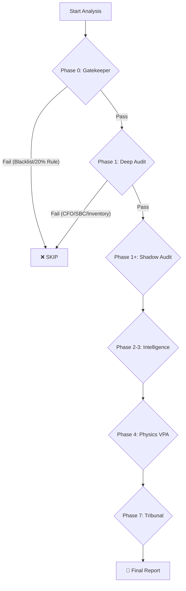
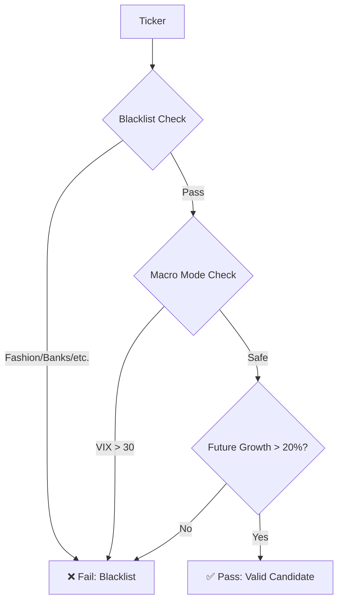
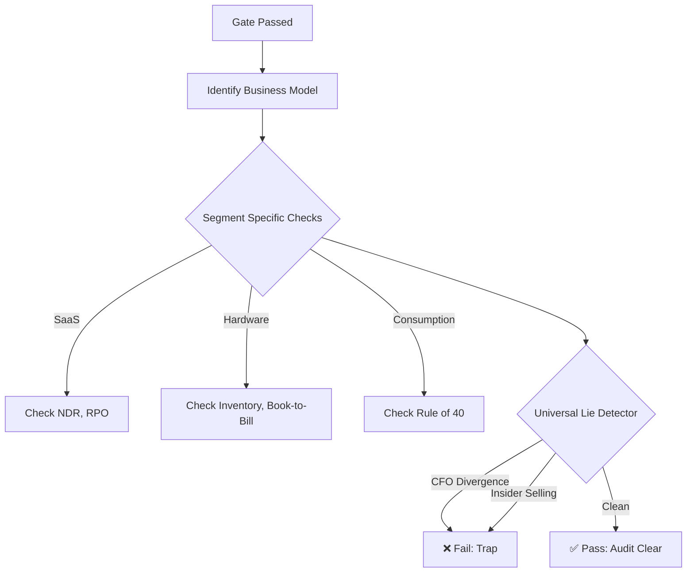
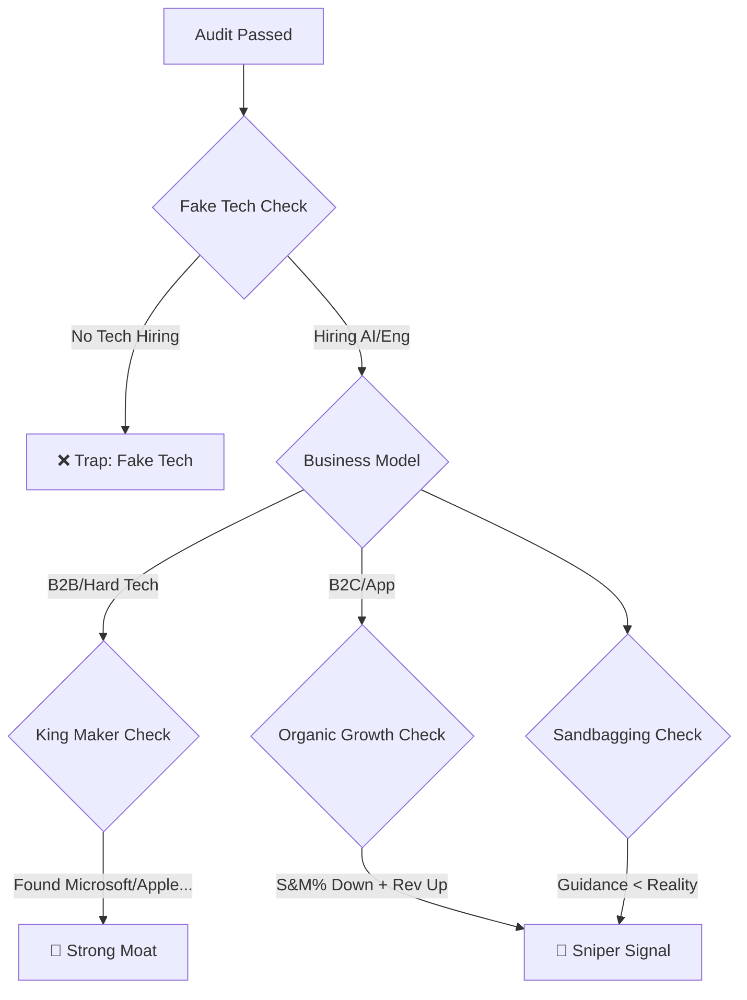
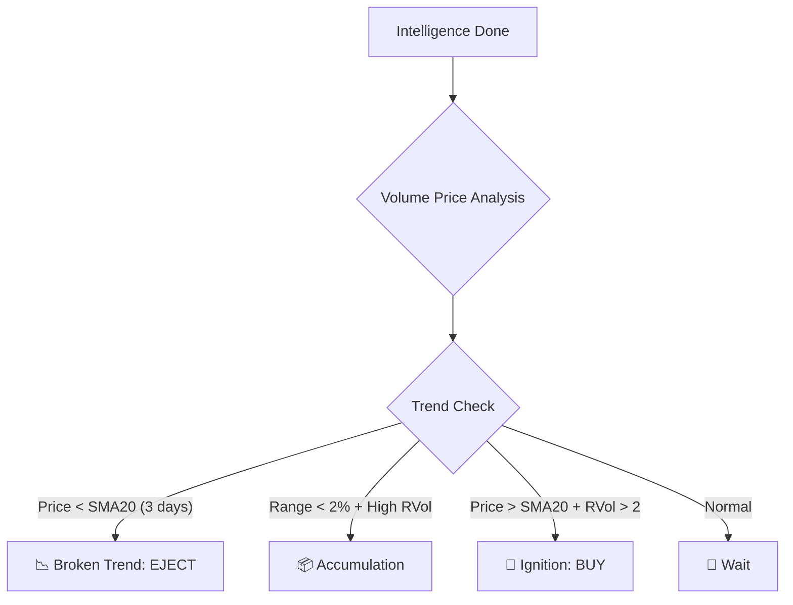

# Mahaney Growth Protocol (MGP) V3.5 - The Singularity Edition

**—— 中大盘成长股"反脆弱全景套利"系统**

**版本代号**：V3.5 (The Singularity Edition / 奇点终极版)
**适用范围**：市值 $10 Billion ~ $50 Billion 美金

---

## 核心哲学 (Core Philosophy)

- **灵魂 (Soul)**：基本面寻找"变异感知"与"真实背书"
- **时机 (Timing)**：催化剂确认"势能"，物理学确认"动能"
- **铁律**：数据可以造假，但巨头的订单和群众的成瘾性无法造假

---

## V3.5 流水线 (Pipeline)


```mermaid
graph TD
    Start[Start Analysis] --> Gatekeeper{Phase 0: Gatekeeper}
    
    Gatekeeper -- "Pass" --> DeepAudit{Phase 1: Deep Audit}
    Gatekeeper -- "Fail (Blacklist/20% Rule)" --> Reject[❌ SKIP]
    
    DeepAudit -- "Pass" --> Shadow{Phase 1+: Shadow Audit}
    DeepAudit -- "Fail (CFO/SBC/Inventory)" --> Reject
    
    Shadow --> Intelligence{Phase 2-3: Intelligence}
    
    Intelligence --> Physics{Phase 4: Physics VPA}
    
    Physics --> Tribunal{Phase 7: Tribunal}
    
    Tribunal --> FinalVerdict[📝 Final Report]
```

---

## Phase 0: 精密靶场与门槛 (Gatekeeper)

**目标**：用"排除法"过滤 90% 的杂音


```mermaid
graph TD
    Input[Ticker] --> Blacklist{Blacklist Check}
    Blacklist -- "Fashion/Banks/etc." --> Fail[❌ Fail: Blacklist]
    Blacklist -- "Pass" --> Macro{Macro Mode Check}
    Macro -- "VIX > 30" --> Fail
    Macro -- "Safe" --> Growth{Future Growth > 20%?}
    Growth -- "No" --> Fail
    Growth -- "Yes" --> Pass[✅ Pass: Valid Candidate]
```

- **绝对黑名单 (Kill Zone)**：Fashion, Regional Banks, Commodities, Auto/Airlines
- **20% 铁律**：未来 3 年预期营收 CAGR > 20% (使用 Yahoo Finance)
- **宏观压力阀**：US10Y 决定 PEG 容忍度
- **VIX 熔断**：VIX > 30 时禁止左侧交易

---

## Phase 1: 深度审计 (Deep Audit)

**目标**：针对不同商业模式进行"核磁共振"级体检


```mermaid
graph TD
    Input[Gate Passed] --> Identify[Identify Business Model]
    Identify --> Metrics{Segment Specific Checks}
    
    Metrics -- "SaaS" --> SaaS[Check NDR, RPO]
    Metrics -- "Hardware" --> Hard[Check Inventory, Book-to-Bill]
    Metrics -- "Consumption" --> Cons[Check Rule of 40]
    
    Metrics --> Universal{Universal Lie Detector}
    Universal -- "CFO Divergence" --> Fail[❌ Fail: Trap]
    Universal -- "Insider Selling" --> Fail
    Universal -- "Clean" --> Pass[✅ Pass: Audit Clear]
```

### 商业模式分层检查

| 模式 | 关键指标 |
|------|----------|
| SaaS/Cyber | NDR > 110%, RPO Growth > Rev Growth |
| Consumption | Rule of 40 (Rev% + FCF% > 40%), SBC < 25% |
| Hard Tech | Book-to-Bill > 1.0, **Inventory Death Cross** 检测 |
| Platform | Take Rate Trap, LTV/CAC > 3 |

### 全局测谎仪 (Universal Lie Detector)

- **CFO 背离**：NI +20% 但 CFO 下降 → TRAP
- **内部人抛售**：通过 Yahoo Finance 检测

---

## Phase 2: 影子验证 (Shadow Audit)

**目标**：不看财报，从侧面验证生意的真实地位


```mermaid
graph TD
    Input[Audit Passed] --> FakeTech{Fake Tech Check}
    FakeTech -- "No Tech Hiring" --> Trap[❌ Trap: Fake Tech]
    FakeTech -- "Hiring AI/Eng" --> PathSelect{Business Model}
    
    PathSelect -- "B2B/Hard Tech" --> KingMaker{King Maker Check}
    KingMaker -- "Found Microsoft/Apple..." --> Bonus[🌟 Strong Moat]
    
    PathSelect -- "B2C/App" --> Organic{Organic Growth Check}
    Organic -- "S&M% Down + Rev Up" --> Sniper[🎯 Sniper Signal]
    
    PathSelect --> Sandbag{Sandbagging Check}
    Sandbag -- "Guidance < Reality" --> Sniper
```

- **Path A (B2B/Tech)**：检验是否有 **King Makers** (Msft, Aapl, Nvda, Amzn, Goog)
- **Path B (B2C/App)**：检验 **Organic Growth** (S&M% 下降 + Rev 增长)
- **Sandbagging Detection**：管理层是否"沙袋" (指引保守但实际强劲) → **Sniper 信号**

---

## Phase 5: 量价物理学 (Physics VPA)

**目标**：捕捉机构进场的瞬间


```mermaid
graph TD
    Input[Intelligence Done] --> VPA{Volume Price Analysis}
    VPA --> Trend{Trend Check}
    
    Trend -- "Price < SMA20 (3 days)" --> Broken[📉 Broken Trend: EJECT]
    Trend -- "Range < 2% + High RVol" --> Accum[📦 Accumulation]
    Trend -- "Price > SMA20 + RVol > 2" --> Ignite[🚀 Ignition: BUY]
    Trend -- "Normal" --> Wait[👀 Wait]
```

- **SMA20**：20日均线 (生命线)
- **RVol**：相对成交量 = Vol / Avg_Vol_20
- **Accumulation (吸筹)**：振幅 < 2% + RVol > 1.5
- **Ignition (点火)**：Price > SMA20 + RVol > 2.0 + Strong Close
- **Broken Trend (止损)**：收盘 < SMA20 连续 3 日

---

## Phase 6: 最终审判 (Tribunal)

**决策矩阵 (规则化)：**

| 决策 | 条件 |
|------|------|
| 🔥 FIRE | All Gates Pass + Ignition + Catalyst |
| 🏰 COMPOUNDER | Strong Fundamentals + King Maker |
| ⚔️ SNIPER | Audit Pass + (Organic Growth OR Sandbagging) |
| 📈 ACCUMULATE | Gates Pass + Accumulation (no Ignition) |
| 👀 WATCH | Default |
| 💣 TRAP | Fake Tech / Broken Trend / CFO Divergence |

---

## 环境要求

```bash
# API Keys (.env)
FMP_API_KEY=your_fmp_key       # FMP Starter 即可
OPENAI_API_KEY=your_openai_key
TAVILY_API_KEY=your_tavily_key
```

## 安装

```bash
pip install -r requirements.txt
```

## 使用方法

```bash
# 分析单只股票
python main.py --tickers DUOL

# 分析多只股票
python main.py --tickers DDOG,CRWD,UBER

# 强制深度分析（忽略 Gate 失败）
python main.py --tickers META --force
```

## 项目结构

```
/
├── config.py             # V3.5 策略参数
├── main.py               # 流水线编排
├── core/
│   └── data_models.py    # 数据模型
├── tools/
│   ├── fmp.py            # FMP API (财务 + OHLCV)
│   ├── yahoo.py          # Yahoo Finance (Estimates + Insider)
│   ├── search.py         # Tavily 搜索
│   └── llm.py            # AI 分析
└── phases/
    ├── gatekeeper.py     # Phase 0: 黑名单 + 20% 铁律
    ├── deep_audit.py     # Phase 1: 深度审计
    ├── shadow_audit.py   # Phase 2: 影子验证 (King Maker/Sandbagging)
    ├── intelligence.py   # Phase 3 & 4: 情报 + 估值
    ├── physics.py        # Phase 5: 量价物理学
    └── tribunal.py       # Phase 6: 最终审判
```

## 免责声明

本工具仅用于辅助研究和学习，**不构成任何投资建议**。投资有风险，入市需谨慎。
