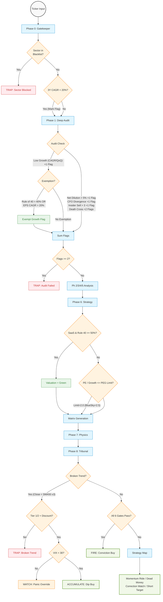

# MGP V3.5 统一参数字典与判定优先级流程图 (Parameter Dictionary & Priority Flow)

本文档汇总了 MGP V3.5 (Master Growth Protocol) 遍布各 Phase 的所有硬性阈值参数，并在一张图内展示完整的判定优先级流向。

---

## Ⅰ. 统一参数字典 (Unified Parameter Dictionary)

| 参数名称 | 默认取值 | 所属 Phase | 所在文件 | 含义与判定逻辑 |
|---------|---------|-----------|---------|--------------|
| `VIX_THRESHOLD` | **30.0** | Gatekeeper (Ph0) | `config.py` | VIX > 30 此时大盘恐慌。不直接 Fail，但在 Tribunal 中若遇技术破位会否决左侧建仓。 |
| `MACRO_TIGHT_YIELD` | **4.5%** | Gatekeeper (Ph0) | `config.py` | US10Y > 4.5% 进入紧缩环境 (TIGHT)；< 3.0% 为宽松 (LOOSE)。影响 Target PE 锚点。 |
| `FUTURE_CAGR_THRESHOLD`| **20.0%** | Gatekeeper (Ph0) | `config.py` | 预期 3 年复合增速铁律。未达标不熔断，交由 Deep Audit 处理 (触发红旗)。 |
| `GROWTH_THRESHOLD_QUARTER`| **5.0%**| Deep Audit (Ph1) | `config.py` | 最近一个季度的环比增速 (Q/Q)。低于该值触发一项红旗。 |
| `RULE_OF_40_EXEMPTION` | **40.0%** | Deep Audit (Ph1) | `deep_audit.py` | 若 Rule of 40 ≥ 40%，**豁免**上述所有的增长红旗。 |
| `EPS_GROWTH_EXEMPTION` | **20.0%** | Deep Audit (Ph1) | `deep_audit.py` | 若 EPS CAGR ≥ 20%，**豁免**上述所有的增长红旗 (证明有利润杠杆)。 |
| `NDR_THRESHOLD` | **110.0%** | Deep Audit (Ph1) | `config.py` | SaaS 企业的净收入留存率下限，暂未使用于绝对拦截。 |
| `MAX_RED_FLAGS` | **2** | Deep Audit (Ph1) | `deep_audit.py` | 审计红旗的容忍上限。累计 ≥ 2 面红旗则 `passed = False`，触发硬性熔断。 |
| `PEG_LIMIT_DEFAULT` | **2.0** | Strategy (Ph6) | `blue_sky.py` | 默认最多容忍两倍成长溢价。`Adjusted PE / Growth > 2.0` 即判定为 Valuation Red。 |
| `PEG_LIMIT_BLUESKY` | **2.5** | Strategy (Ph6) | `strategy.py` | 若判定存在强第二曲线 (Blue Sky)，容忍上限放宽至 2.5。 |
| `RULE_OF_40_VAL_EXEMPTION`| **50.0%** | Strategy (Ph6) | `strategy.py` | SaaS 独有：Rule of 40 ≥ 50% 时，无视 PEG 和 P/S 限制，估值强制为 Green。 |
| `SMA_TREND_WINDOW` | **50 日** | Physics (Ph7) | `physics.py` | (V3.5 自 20 调整) 连续跌破 50 日均线 (SMA50) 达 3天 作为中大盘趋势破位标准。 |

---

## Ⅱ. 判定优先级与控制流图 (Priority Flowchart)

以下流程图详细展示了从输入代码到生成最终投资指令 (Decision) 的多级筛选机制。其中红色节点为**熔断点**，绿色为**豁免/直通点**。

### 三大逻辑主线总结：

1. **增长宽容主线 (Growth Tolerance)**
   * 要求 20% 未来 CAGR 和 5% 环比增长，但如果企业展现出**超强的软件效率**（Rule of 40 > 40%）或**极好的盈利杠杆**（EPS CAGR > 20%），则完全豁免所有的营收增长指控。
2. **估值宽容主线 (Valuation Tolerance)**
   * 默认 PEG 上限为 2.0。如果证明拥有**第二增长曲线** (Blue Sky)，上限放宽至 2.5。如果属于顶级 SaaS 模型（Rule of 40 > 50%），**无视任何估值倍数**（强制 Green），因为这种标的永远不可能在传统模型下显得便宜。
3. **左侧抄底主线 (Fortress Accumulation)**
   * 如果技术形态破位死亡（Broken Trend），普通公司直接熔断（TRAP）。但如果公司拥有**顶级护城河** (Tier 1/2) 且存在由于短期非基本面利空导致的**真实折价** (True Discount)，系统会尝试进行左侧建仓推荐 (ACCUMULATE)。唯独此时**VIX > 30**会一票否决（恐慌不接落刃）。
